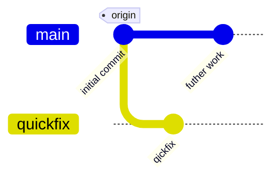
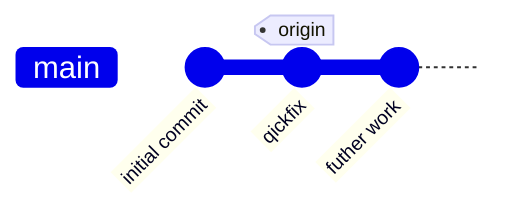

## Aufgabe: Commit auf dem falschen Branch

### Ziel:

In dieser Aufgabe lernen Sie, wie Sie mit git einen Commit, der auf dem falschen Branch erstellt wurde, in den richtigen Branch verschieben können. Dies ist nützlich, wenn Sie versehentlich einen Commit auf einem anderen Branch als dem beabsichtigten erstellt haben.

### Hintergrund:

In der Git-Workflow-Praxis kann es vorkommen, dass Sie an einem Branch arbeiten und versehentlich einen Commit auf einen anderen Branch erstellen. Dies kann zu Verwirrung und Problemen führen, wenn Sie Ihre Änderungen mit anderen teilen.

Mit Git können Sie Commits von einem Branch in einen anderen verschieben. Dies ermöglicht es Ihnen, Ihre Commit-Historie zu bereinigen und sicherzustellen, dass Ihre Änderungen im richtigen Branch gespeichert sind.

### Setup:

Aufgabe mit dem `setup.sh`-Skript einrichten:

```bash
chmod +x setup.sh
./setup.sh
```

Aufgabe im Unterordner "exercise" bearbeiten:

```bash
cd exercise
```

### Aufgabe:

Sie arbeiten sehr hart am Main-Zweig.
Ein Teil Ihrer Arbeit ist bereits abgeschlossen. In diesem Moment kommt Ihr Chef mit einer dringenden Anfrage herein.

Da Ihr aktueller HEAD noch nicht bereit für die Prime-Time ist, sichern Sie einen Commit und starten einen neuen Zweig mit dem Namen 'quickfix'. Dann stellen Sie fest, dass Sie ein kleines Chaos mit Ihren Zweigen angerichtet haben.

Momentan sehen Ihre Commits wie folgt aus



Sie wollen aber, dass es wie folgt aussieht:


